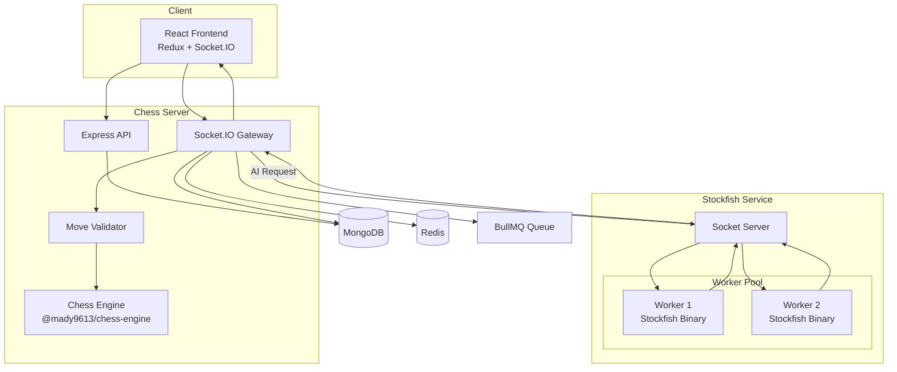
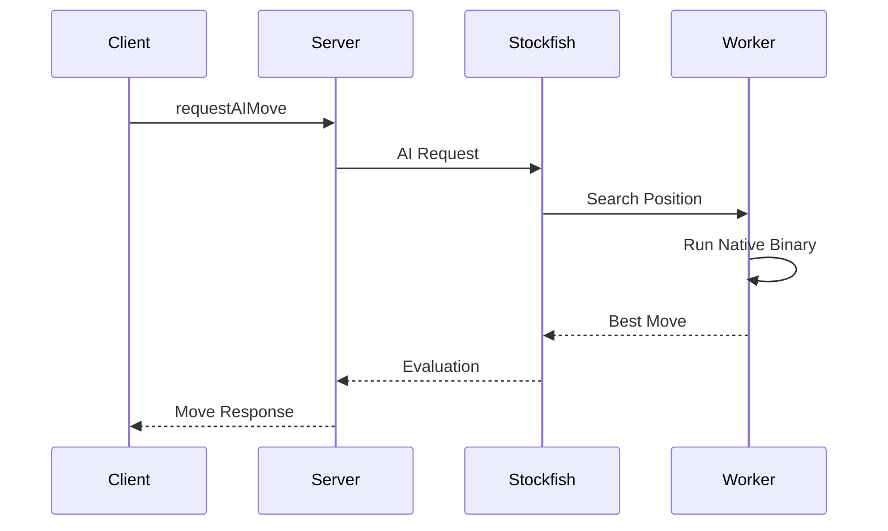
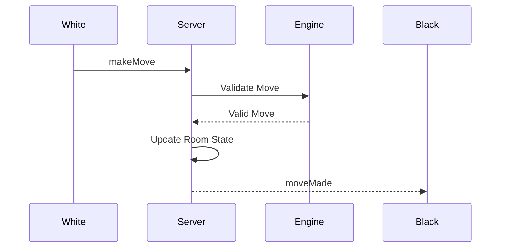
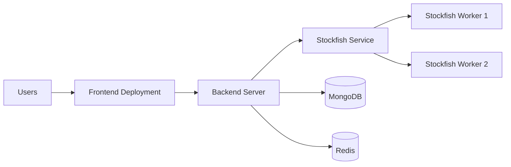

# ♟️ GRANDMASTER ARCAD


<p align="center">


</p>


<h3 align="center">
A scalable real-time multiplayer chess platform with custom chess engine, matchmaking, and Stockfish AI microservice.
</h3>


<p align="center">

Built with modern full-stack technologies and service-oriented architecture.

</p>


## 🚀 Live Demo


| Service | Link |
|---|---|
| 🌐 Frontend | https://chess-chi-wine.vercel.app/ |
| ⚙️ Backend API | https://chess-server-4657.onrender.com |
| 🤖 Stockfish Service | https://chess-i2kg.onrender.com |


---

# 🛠️ Tech Stack


<p align="center">


</p>


### Frontend

- React 19
- Vite
- Redux Toolkit
- React Router
- Tailwind CSS
- Socket.IO Client


### Backend

- Node.js
- Express.js
- Socket.IO
- MongoDB
- Mongoose
- Redis
- BullMQ


### AI Service

- Node.js Socket Server
- Native Stockfish Binary
- Worker Pool Architecture


### Custom Engine

- JavaScript Chess Engine
- Published package:

```
@mady9613/chess-engine
```


---

# 📸 Screenshots


## Multiplayer Game


## AI Practice Mode


## Game Analysis
<p align="center">


</p?


## Matchmaking


## guest watch mode:


## Live chat:


---

# ✨ Features


## ♟️ Chess Gameplay

- Real-time multiplayer chess
- Private rooms
- Matchmaking
- Spectator mode
- Live chat
- Game clock
- Move history
- Game replay support


## 🤖 AI Features

- Play against Stockfish
- Multiple difficulty levels
- Position analysis
- Best move suggestions
- Evaluation lines


## 🔐 Authentication

- Email/password authentication
- Google OAuth
- Protected multiplayer actions


## ⚡ Infrastructure

- Redis powered matchmaking
- BullMQ background jobs
- MongoDB persistence
- Socket.IO realtime communication
- Separate AI computation service


---

# 🏗️ Architecture





---

# 📂 Project Structure


```
Chess Platform

│
├── frontend2
│
├── server
│
├── chess-engine
│
└── stockfish-service

```


---

# 🎨 Frontend Service


## frontend2


Responsible for:

- Chess board UI
- User interaction
- Local gameplay
- Multiplayer synchronization
- AI mode
- Analysis interface


Architecture:


```
React

 |

Redux Store

 |

ChessGame Instance

 |

Socket.IO Client

```


---

# ⚙️ Backend Service


## server


Responsible for:


- Authentication
- Room management
- Matchmaking
- Socket events
- Move validation
- Game persistence
- AI communication


Structure:


```
server/

├── index.js

├── routes/

├── sockets/

├── models/

├── utils/

└── queues/

```


---

# ♟️ Chess Engine


The custom chess engine provides:


- Legal move generation
- Move validation
- Check detection
- Checkmate detection
- Castling
- En-passant
- Promotion
- FEN support
- SAN generation


Used by:


```
Frontend
    |
Chess Engine


Backend
    |
Chess Engine Validation

```


---

# 🤖 Stockfish AI Service


Stockfish is isolated into a separate service because the engine is CPU and memory intensive.


Old:


```
Server

 |

Stockfish

```


New:


```
Server

 |

Socket Connection

 |

Stockfish Service

 |

Worker Pool

 |

Native Stockfish Binary

```


## Worker Architecture


```
Stockfish Service


        Socket Server


              |


       ----------------

       |              |

   Worker 1       Worker 2

       |              |

 Stockfish      Stockfish

 Binary         Binary

```


Benefits:


- Independent scaling
- Lower backend memory usage
- Multiple concurrent AI searches
- Better deployment flexibility


---

# 🔥 Request Flow





---

# 🌐 Multiplayer Flow





---

# 💾 Database Design


## MongoDB


### User

Stores:

- Profile
- Authentication
- OAuth information


### Room

Active game state:


```
Room

 ├── Players

 ├── Current FEN

 ├── Turn

 ├── Move History

 └── Status

```


### Game


Historical archive:


```
Game

 ├── Players

 ├── Moves

 ├── Result

 └── Metadata

```


---

# 🚀 Deployment Architecture





---

# ⚙️ Environment Variables


## Frontend


```env

VITE_API_URL=

VITE_SOCKET_URL=

```


## Backend


```env

PORT=

MONGO_URI=

REDIS_URL=

AUTH_SECRET=

STOCKFISH_SERVICE_URL=

```


## Stockfish Service


```env

PORT=

WORKER_COUNT=2

STOCKFISH_PATH=

```


---

# 🛠️ Local Development


Start Redis:


```bash
docker compose up -d redis
```


Start Stockfish:


```bash
cd stockfish-service

npm install

npm run start
```


Start Backend:


```bash
cd server

npm install

npm run dev
```


Start Frontend:


```bash
cd frontend2

npm install

npm run dev
```


---


---

# 👨‍💻 Author


**Madhujya Rajkhowa**

B.Tech Artificial Intelligence & Machine Learning

NIT Kurukshetra
